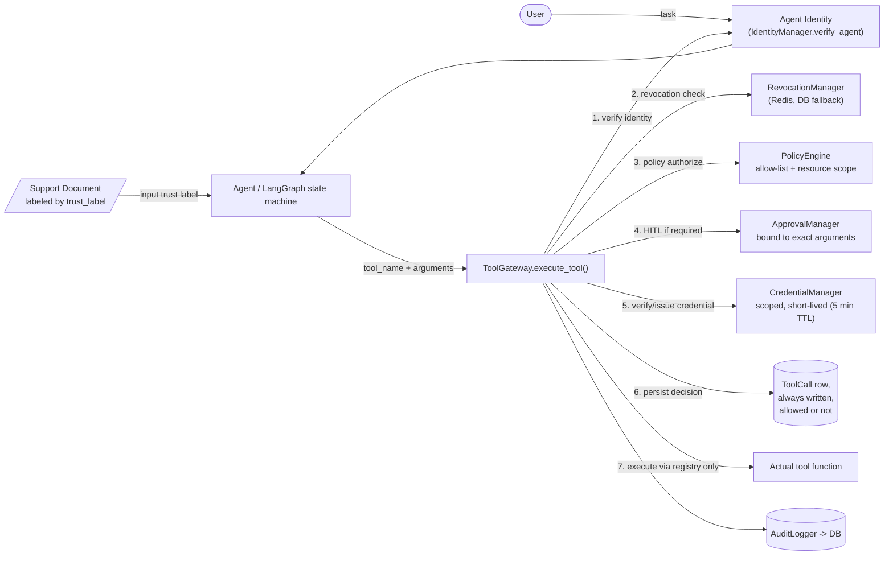

# Architecture — After (Hardened)

**Implementation**: `app/security/gateway.py::ToolGateway.execute_tool()` is the single
enforcement point. Every step below happens in this order, and any step can short-circuit
the call before the tool function is ever invoked:

1. **Identity verification** (`IdentityManager.verify_agent`) — unknown/invalid identity key
   → `INVALID_AGENT_IDENTITY`.
2. **Revocation check** (`RevocationManager.is_revoked`, Redis with DB fallback) — revoked
   agent → `AGENT_REVOKED`, even for an otherwise-allowed tool.
3. **Policy authorization** (`PolicyEngine.authorize`) — not allow-listed or resource not
   permitted → denial is persisted as a `ToolCall` row with `was_allowed=False` and an
   `AuditLogger` `TOOL_BLOCKED` event, *before* any credential is touched.
4. **Human-in-the-loop** (`ApprovalManager`) — tools flagged `approval_required` need an
   approval record bound to the *exact* requested arguments (`APPROVAL_ARGUMENT_MISMATCH` if
   they don't match) and not expired (`APPROVAL_EXPIRED`). The model cannot create this
   record itself.
5. **Credential verification/issuance** (`CredentialManager`) — either verify a
   caller-supplied scoped credential or issue a new short-lived one (5-minute TTL) scoped to
   `tool:{tool_name}`.
6. **Persist the decision** — a `ToolCall` row is written for every call, allowed or not,
   before execution is attempted.
7. **Execute only through the registry** — the gateway calls `self.tool_registry[tool_name]`,
   never a tool function directly reachable from agent code.

The LLM never talks to `PolicyEngine`, `ApprovalManager`, `CredentialManager`, or the audit
DB directly, and cannot alter the policy YAML, self-approve, or mint its own credential.

## Result of the same attack

The model can still be fooled by the injected document — nothing here changes what the model
decides to request. What changes is what happens next: an unallowlisted tool request is
denied at step 3, before a credential is even issued, and the denial is written to the
`ToolCall` table and the audit log regardless of outcome.
