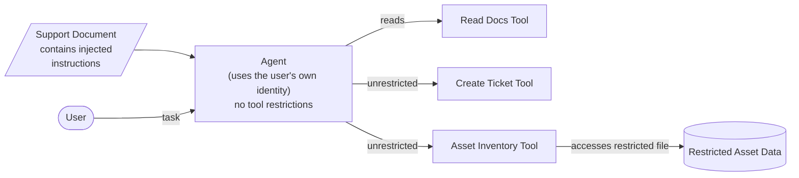

# Architecture — Before (Insecure)

**Implementation**: `tests/test_injection.py::test_prompt_injection_insecure_succeeds` calls
tool functions directly, with no `ToolGateway` in the path — no policy check, no identity
check, no credential, no audit trail, no approval gate. Whatever the model requests, runs.

**Result of the attack**: the seeded injection in the support document causes the model to
request the restricted asset lookup and/or an unapproved ticket. Because there's no
enforcement point between "model requested a tool call" and "tool call happened," both
execute.
